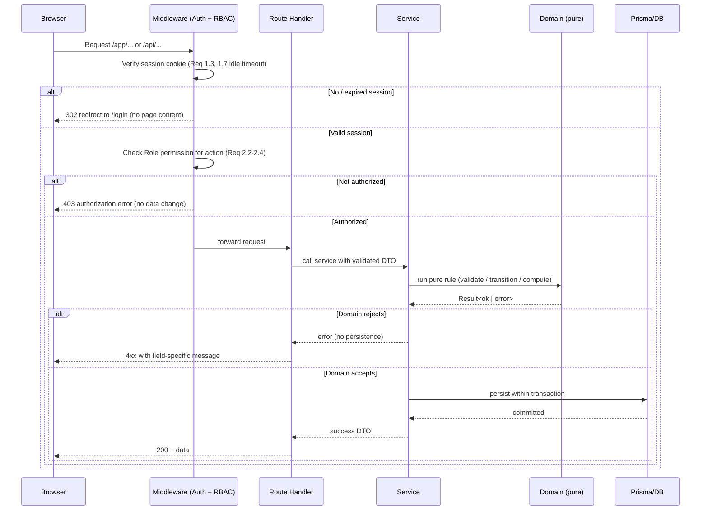
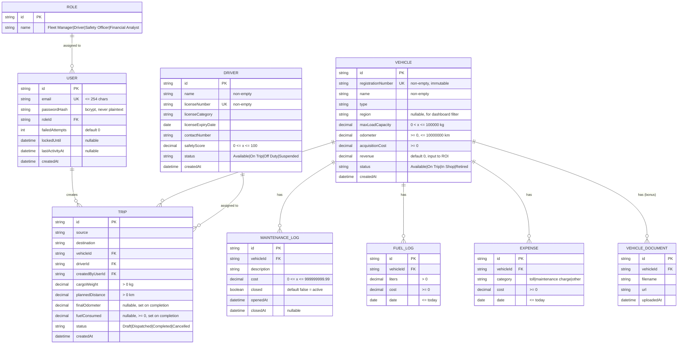
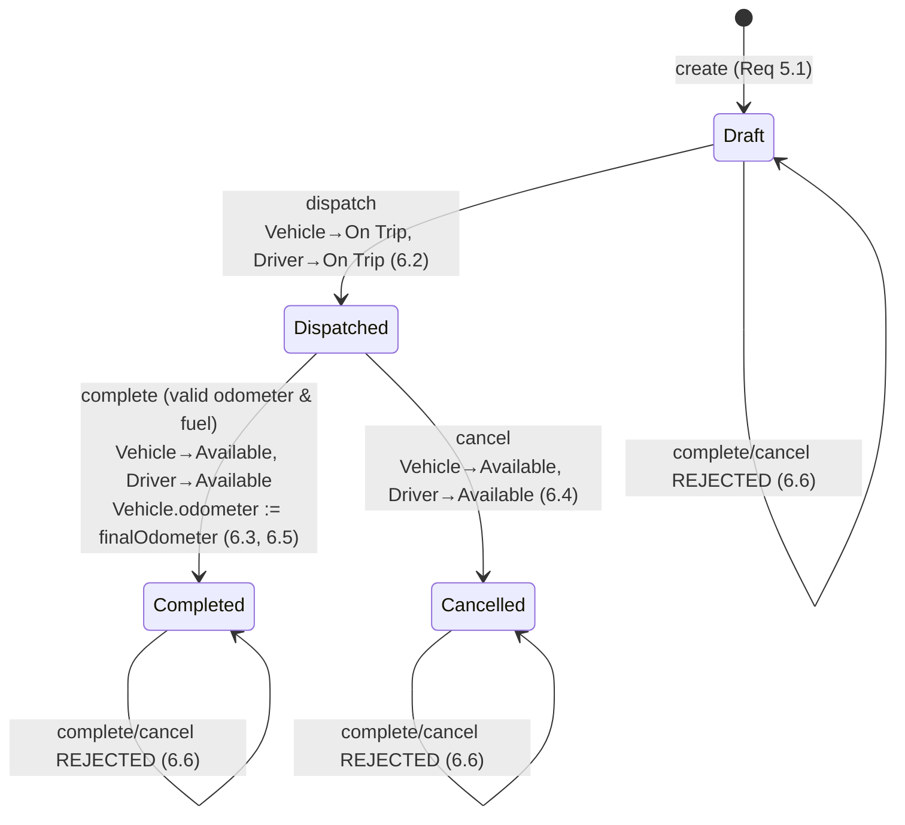
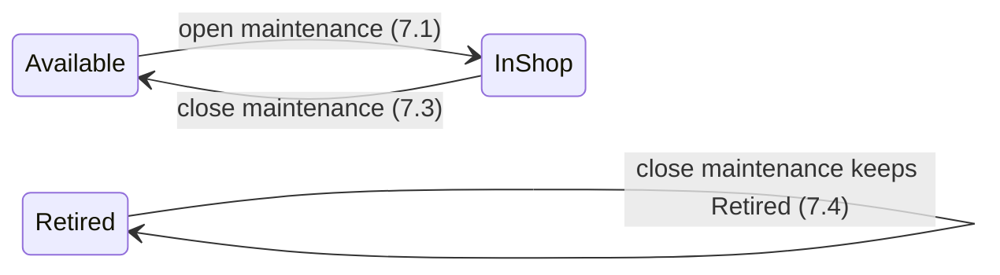

# Design Document

## Overview

TransitOps is a centralized, SaaS-style web application that manages the full lifecycle of vehicles, drivers, trips, maintenance, fuel, and expenses for a logistics company. This design targets an **8-hour hackathon build** and is deliberately structured around two goals that are usually in tension:

1. **SaaS-professional quality** — clean layered architecture, a real relational data model with integrity constraints, proper role-based access control, deterministic business rules, and a responsive dashboard.
2. **Pragmatic buildability** — a single-language, single-repo, batteries-included stack that removes glue code and lets us spend the 8 hours on the business rules that define correctness (Requirements 1–10) rather than on infrastructure.

The central design decision is to isolate all mandatory business rules into a **pure, framework-free domain layer**. Dispatch eligibility, capacity checks, conflict detection, the trip/maintenance status state machines, and the analytics computations are all pure functions with no I/O. This keeps the rules fast to write, trivial to reason about, and directly testable with property-based tests (see Correctness Properties). Everything else — HTTP, persistence, auth session plumbing, UI — is a thin shell around that core.

### Technology Stack and Rationale

| Concern | Choice | Why (for an 8-hour SaaS build) |
|---|---|---|
| Language | **TypeScript** (end to end) | One language for domain, API, and UI. No context switching, shared types between server and client. |
| Framework | **Next.js 14 (App Router)** | Single deployable full-stack app: React UI + server-side Route Handlers in one repo. No separate backend to wire up. Deploys to Vercel in minutes for a live SaaS URL. |
| Persistence | **Prisma ORM** over **PostgreSQL** (all environments) | Prisma gives us the schema, migrations, unique constraints, and typed queries for free, and PostgreSQL is the same engine in dev and prod so there are no dialect surprises. To keep hackathon setup near-zero, run a local Docker Postgres container for dev (a one-line `docker-compose` service) and/or point `DATABASE_URL` at a managed serverless Postgres like **Neon** or **Supabase** for a live SaaS URL. A free managed instance or the docker-compose service keeps setup minimal while selling the SaaS story with a real production-grade database. |
| Auth | **Auth.js (NextAuth) Credentials provider** + **bcrypt** + JWT session cookie | Handles session cookies, redirects, and CSRF out of the box. We layer custom lockout and idle-timeout logic on top (Req 1.6, 1.7). Password hashing via bcrypt (Req 1.4). |
| UI | **Tailwind CSS** + **shadcn/ui** components | Professional, consistent SaaS look with almost no custom CSS. Responsive utilities cover the 360–1920px requirement (Req 10.6). |
| Charts (bonus) | **Recharts** | Declarative React charts for Req 11. |
| Tables/search (bonus) | **TanStack Table** | Client-side search/filter/sort for Req 15. |
| CSV / PDF | **Manual CSV writer** / **pdf-lib** or **@react-pdf/renderer** | CSV is trivial and dependency-light (Req 9.7). PDF is bonus only (Req 12). |
| Testing | **Vitest** + **fast-check** | Vitest is the fastest TS test runner; fast-check is the standard TS property-based testing library used for the Correctness Properties. |

This stack means the entire product is one `npm` project, one command to run, and one command to test — which is what protects the timeline.

### Scope Discipline (Mandatory vs Bonus)

The build order is strictly **Requirements 1–10 first**. Bonus features (11–16) are implemented as **additive, isolated modules** that never change the mandatory data model or domain functions:

- Charts (11) read the same analytics functions the reports already use.
- PDF export (12) is a second renderer beside the CSV writer.
- Email reminders (13) read the existing driver license data.
- Document management (14) adds one table with a foreign key to Vehicle.
- Search/filter/sort (15) is client-side over lists that already exist.
- Dark mode (16) is a Tailwind theme toggle.

Because each bonus is additive, the team can stop at any point after Requirement 10 and still ship a correct, coherent product. See the "Scope-to-Timeline Mapping" section at the end.

## Architecture

TransitOps uses a **layered monolith**: a Next.js app split into UI (React Server/Client Components), an API layer (Route Handlers), an application/service layer, a pure domain layer, and a persistence layer (Prisma). The glossary services (Auth_Service, Access_Control, Vehicle_Registry, Driver_Registry, Trip_Service, Maintenance_Service, Expense_Service, Analytics_Service, Dashboard_Service) map to modules in the service + domain layers.

```mermaid
graph TD
    subgraph Client["Browser (React / Tailwind / shadcn-ui)"]
        UI_Login[Login View]
        UI_Dash[Dashboard View]
        UI_Fleet[Vehicles / Drivers Views]
        UI_Trips[Trips View]
        UI_Reports[Reports View]
    end

    subgraph Next["Next.js App (single deployable)"]
        subgraph API["API Layer — Route Handlers /app/api/*"]
            MW[Auth + RBAC Middleware]
            R_Auth[/api/auth/*]
            R_Veh[/api/vehicles/*]
            R_Drv[/api/drivers/*]
            R_Trip[/api/trips/*]
            R_Mnt[/api/maintenance/*]
            R_Exp[/api/expenses, /api/fuel/*]
            R_Ana[/api/reports/*]
            R_Dash[/api/dashboard/*]
        end

        subgraph SVC["Service Layer (orchestration + persistence calls)"]
            S_Auth[Auth_Service]
            S_AC[Access_Control]
            S_Veh[Vehicle_Registry]
            S_Drv[Driver_Registry]
            S_Trip[Trip_Service]
            S_Mnt[Maintenance_Service]
            S_Exp[Expense_Service]
            S_Ana[Analytics_Service]
            S_Dash[Dashboard_Service]
        end

        subgraph DOM["Domain Layer (pure functions — no I/O)"]
            D_Elig[dispatch eligibility]
            D_Cap[capacity + conflict checks]
            D_TripSM[trip state machine]
            D_MntSM[maintenance state machine]
            D_Calc[analytics + operational cost]
            D_Valid[field validators]
            D_RBAC[permission matrix]
        end
    end

    subgraph Data["Persistence"]
        Prisma[Prisma ORM]
        DB[(PostgreSQL)]
    end

    Client -->|HTTPS/JSON| API
    MW --> R_Auth & R_Veh & R_Drv & R_Trip & R_Mnt & R_Exp & R_Ana & R_Dash
    R_Auth --> S_Auth
    R_Veh --> S_Veh
    R_Drv --> S_Drv
    R_Trip --> S_Trip
    R_Mnt --> S_Mnt
    R_Exp --> S_Exp
    R_Ana --> S_Ana
    R_Dash --> S_Dash

    MW --> S_AC
    S_AC --> D_RBAC
    S_Veh --> D_Valid
    S_Drv --> D_Valid
    S_Trip --> D_Elig & D_Cap & D_TripSM & D_Valid
    S_Mnt --> D_MntSM
    S_Exp --> D_Calc & D_Valid
    S_Ana --> D_Calc
    S_Dash --> D_Calc

    SVC --> Prisma --> DB
```

### Request Lifecycle

Every application request passes through the same pipeline, which is where cross-cutting rules (session, RBAC) live:



### Key Architectural Principles

- **Pure domain core.** Business rules take plain data in and return plain data/results out. No database, no HTTP, no clock reads inside them (the current time/date is passed in as a parameter). This is what makes the mandatory rules property-testable.
- **Transactional state transitions.** A trip dispatch changes three rows (Trip, Vehicle, Driver). These multi-row transitions run inside a single database transaction so a vehicle can never be left "On Trip" without a corresponding "Dispatched" trip (Req 6).
- **Fail-closed authorization.** Any action not explicitly granted to a role is denied (Req 2.4). The permission matrix is a single source of truth.
- **Deterministic analytics.** All KPI and report math is pure and guards every division (Req 9.4–9.6, 10.9).

## Components and Interfaces

Each glossary service is a module. Below is the responsibility and primary interface (API endpoints + key service functions) of each. All endpoints sit under `/api` and return JSON; all mutating endpoints are guarded by the Auth + RBAC middleware.

### Auth_Service (Req 1)

Responsibilities: registration hashing, login/logout, session issuance, account lockout, idle-session timeout, input length limits.

| Endpoint | Method | Purpose | Requirement |
|---|---|---|---|
| `/api/auth/login` | POST | Authenticate email+password, issue session | 1.1, 1.2, 1.6, 1.8 |
| `/api/auth/logout` | POST | Terminate session, redirect to login | 1.5 |
| `/api/auth/session` | GET | Return current session or 401 | 1.3, 1.7 |

Key logic:
- Passwords stored as bcrypt hashes; plaintext never persisted or returned (1.4).
- Login failures tracked per email with `failedAttempts` + `lockedUntil`; 5 failures in 15 min → 15-min lock (1.6).
- Sessions carry `lastActivityAt`; middleware treats a session idle > 30 min as expired (1.7).
- Email > 254 or password > 128 chars rejected before any DB lookup (1.8).
- Error messages are generic ("Invalid email or password") to avoid user enumeration (1.2).

### Access_Control (Req 2)

Responsibilities: enforce the RBAC matrix on every action; fail closed.

Interface (pure): `can(role: Role, action: Action): boolean` backed by a static permission map. Middleware calls `can()` before routing to any service. See the RBAC Authorization Matrix section for the full map.

### Vehicle_Registry (Req 3, 14)

| Endpoint | Method | Purpose | Requirement |
|---|---|---|---|
| `/api/vehicles` | GET | List all vehicles with status | 3.4 |
| `/api/vehicles` | POST | Create vehicle (validated, unique reg no., status=Available) | 3.1, 3.2, 3.8 |
| `/api/vehicles/:id` | PATCH | Update editable fields (reg no. immutable) | 3.5, 3.9 |
| `/api/vehicles/:id/retire` | POST | Set status=Retired | 3.6, 3.7 |
| `/api/vehicles/:id/documents` | POST | (Bonus) upload document | 14.1, 14.2 |

### Driver_Registry (Req 4)

| Endpoint | Method | Purpose | Requirement |
|---|---|---|---|
| `/api/drivers` | GET | List drivers with status + license expiry + license validity flag | 4.3, 4.5, 4.6 |
| `/api/drivers` | POST | Create driver (validated, unique license no., status=Available) | 4.1, 4.7, 4.8 |
| `/api/drivers/:id` | PATCH | Update editable fields incl. compliance data | 4.4 |

### Trip_Service (Req 5, 6)

| Endpoint | Method | Purpose | Requirement |
|---|---|---|---|
| `/api/trips` | GET | List trips (filter by status) | 6, 10.4 |
| `/api/trips/dispatch-pool` | GET | Eligible vehicles + drivers for assignment | 5.2, 5.3, 5.4, 7.2 |
| `/api/trips` | POST | Create Draft trip (validate, capacity, conflict) | 5.1, 5.5, 5.6, 5.8 |
| `/api/trips/:id/dispatch` | POST | Draft→Dispatched; vehicle+driver→On Trip | 6.2 |
| `/api/trips/:id/complete` | POST | Dispatched→Completed; update odometer; vehicle+driver→Available | 6.3, 6.5, 6.6, 6.7 |
| `/api/trips/:id/cancel` | POST | Dispatched→Cancelled; vehicle+driver→Available | 6.4, 6.6 |

### Maintenance_Service (Req 7)

| Endpoint | Method | Purpose | Requirement |
|---|---|---|---|
| `/api/maintenance` | POST | Open record; vehicle→In Shop (reject if Retired) | 7.1, 7.7 |
| `/api/maintenance/:id/close` | POST | Close record; vehicle→Available unless Retired | 7.3, 7.4 |
| `/api/maintenance/:id/cost` | PATCH | Record validated maintenance cost | 7.5, 7.6, 7.8 |

### Expense_Service (Req 8)

| Endpoint | Method | Purpose | Requirement |
|---|---|---|---|
| `/api/fuel` | POST | Record fuel log (validated) | 8.1, 8.2 |
| `/api/expenses` | POST | Record expense (validated) | 8.3, 8.4 |
| `/api/vehicles/:id/operational-cost` | GET | Fuel cost + maintenance cost sum | 8.5, 8.6 |

### Analytics_Service (Req 9, 11, 12)

| Endpoint | Method | Purpose | Requirement |
|---|---|---|---|
| `/api/reports/fuel-efficiency` | GET | km/L per vehicle (NA if fuel=0) | 9.1, 9.4 |
| `/api/reports/fleet-utilization` | GET | % On Trip vs non-Retired (NA if none) | 9.2, 9.5 |
| `/api/reports/vehicle-roi` | GET | ROI per vehicle (NA if acquisition=0) | 9.3, 9.6 |
| `/api/reports/export?format=csv` | GET | CSV export | 9.7, 9.8 |
| `/api/reports/export?format=pdf` | GET | (Bonus) PDF export | 12.1, 12.2 |

### Dashboard_Service (Req 10)

| Endpoint | Method | Purpose | Requirement |
|---|---|---|---|
| `/api/dashboard?filters=...&view=default\|full` | GET | KPIs, optionally filtered; returns the role-appropriate Default Dashboard View plus the full KPI set | 10.1–10.14 |

The Dashboard is a **single route and component** (`/dashboard`). On load it reads the authenticated user's `Role` from the session and selects a **Default Dashboard View** — the subset of KPIs/widgets emphasized first for that role (Req 10.10–10.13). Crucially, this is a **presentation-layer concern only**:

- The dashboard endpoint always computes the **complete** KPI set from criterion 10.1; the `view` parameter (default `default`) only tells the response which subset to mark as the emphasized default. Passing `view=full` (or simply expanding the UI) exposes every KPI to any authenticated user regardless of role (Req 10.14). The role tailoring is **initial emphasis, never a hard viewing restriction**.
- **No new backend business logic or data model changes are required.** Every KPI value is produced by the *same pure functions already defined* (counts in "Dashboard KPIs", `fleetUtilization`, `operationalCost`, `fuelEfficiency`, `vehicleROI`, `isLicenseExpired`, and the one new pure derivation `isLicenseSoonToExpire`). The role → default-view selection is a single pure mapping function consumed by the UI; it adds no persistence, no new tables, and no new endpoints beyond the `view` query flag.

**Per-role Default Dashboard View (widget sets):**

| Role | Default Dashboard View (emphasized KPIs) | Req |
|---|---|---|
| Fleet Manager | Active Vehicles, Available Vehicles, Vehicles in Maintenance, Fleet Utilization | 10.10 |
| Driver | Pending Trips, Active Trips, count of Available Vehicles, count of Available Drivers | 10.11 |
| Safety Officer | count of Expired License drivers, count of Soon-To-Expire License drivers, count of Suspended drivers, Drivers On Duty, and the Safety Score of each displayed Driver | 10.12 |
| Financial Analyst | Operational Cost, Fuel Efficiency, Vehicle ROI (financial summary) | 10.13 |

All four subsets are drawn from KPIs the endpoint already computes, so any role can toggle to the full set (Req 10.14) with no additional server work.

## Data Models

The relational schema (Prisma models over PostgreSQL). All monetary and measurement fields use appropriate numeric types; PostgreSQL's native `NUMERIC`/`Decimal` type (mapped to Prisma `Decimal`) is used for currency and measurement fields to avoid floating-point error.

### Entity Relationship Diagram



### Status Enumerations

| Enum | Values | Source |
|---|---|---|
| `Role` | Fleet Manager, Driver, Safety Officer, Financial Analyst | Req 2.1 |
| `VehicleStatus` | Available, On Trip, In Shop, Retired | Req 3.3 |
| `DriverStatus` | Available, On Trip, Off Duty, Suspended | Req 4.2 |
| `TripStatus` | Draft, Dispatched, Completed, Cancelled | Req 6.1 |

### Key Constraints and Integrity Rules

- **Uniqueness**: `Vehicle.registrationNumber` (Req 3.2) and `Driver.licenseNumber` (Req 4.8) are enforced with database `UNIQUE` constraints, not just application checks. This guarantees uniqueness even under concurrent inserts.
- **Immutability**: `Vehicle.registrationNumber` is never included in the update DTO (Req 3.5).
- **Derived, not stored**: `Operational Cost`, `Fuel Efficiency`, `Fleet Utilization`, `Vehicle ROI`, and all dashboard KPIs are **computed on read** from source rows, never denormalized. This makes Req 8.6's "recompute within 2 seconds after any change" automatic — there is no cached value to invalidate.
- **License validity is derived**: "Expired License" is computed by comparing `licenseExpiryDate` to the current date at request time (Req 4.5, 4.6); it is not a stored column.

## Critical Correctness Logic

This is the heart of the system. All of the following are implemented as **pure functions** in the domain layer and are the primary targets of property-based testing. The current date/time is always passed in as a parameter so the functions stay deterministic and testable.

### Dispatch Eligibility Pool (Req 5.2–5.4, 7.2)

The pool is computed by filtering the full vehicle and driver sets. A vehicle is eligible **only** if its status is `Available`; anything `On Trip`, `In Shop`, or `Retired` is excluded. Because opening a maintenance record sets the vehicle to `In Shop` (Req 7.1), the `Available`-only rule automatically satisfies Req 7.2 (vehicles with an active maintenance record are excluded) — there is no separate check to keep in sync.

```typescript
// domain/dispatch.ts  (pure)
function eligibleVehicles(vehicles: Vehicle[]): Vehicle[] {
  return vehicles.filter(v => v.status === "Available");
}

function isLicenseExpired(driver: Driver, today: Date): boolean {
  return driver.licenseExpiryDate < startOfDay(today);
}

function eligibleDrivers(drivers: Driver[], today: Date): Driver[] {
  return drivers.filter(
    d => d.status === "Available" && !isLicenseExpired(d, today)
  );
}
```

Rationale: expressing eligibility as `status === "Available"` (rather than "not in a blocked set") is the safest fail-closed formulation — any future status is excluded by default.

### Cargo Capacity Validation (Req 5.6, 5.7)

A trip may proceed only if cargo weight does not exceed the selected vehicle's maximum load capacity. Equality is allowed (Req 5.7 uses "less than or equal to").

```typescript
function capacityOk(cargoWeight: number, vehicle: Vehicle): boolean {
  return cargoWeight <= vehicle.maxLoadCapacity;
}
```

### Conflict Detection (Req 5.5)

Assigning a resource whose status is `On Trip` is a conflict, even if it somehow appears in a stale pool. This is a defensive re-check at assignment time and identifies the specific conflicting resource in the error.

```typescript
function assignmentConflict(vehicle: Vehicle, driver: Driver):
  { conflict: true; resource: "vehicle" | "driver" } | { conflict: false } {
  if (vehicle.status === "On Trip") return { conflict: true, resource: "vehicle" };
  if (driver.status === "On Trip")  return { conflict: true, resource: "driver" };
  return { conflict: false };
}
```

### Trip Status State Machine (Req 6)

This is the core correctness of the system: trip status changes and the *coupled* automatic changes to vehicle and driver status. The machine is a single pure transition function that returns the next state of **all three entities** plus any side-effect data (odometer update). The service layer then persists all changes in **one transaction**.



Transition rules, precisely:

| Action | Guard | Trip → | Vehicle → | Driver → | Other effect |
|---|---|---|---|---|---|
| dispatch | trip is `Draft` | `Dispatched` | `On Trip` | `On Trip` | — |
| complete | trip is `Dispatched` AND `finalOdometer ≥ vehicle.odometer` AND `fuelConsumed ≥ 0` | `Completed` | `Available` | `Available` | `vehicle.odometer := finalOdometer` (6.5) |
| cancel | trip is `Dispatched` | `Cancelled` | `Available` | `Available` | — |
| complete/cancel | trip not `Dispatched` | **reject, no change** (6.6) | unchanged | unchanged | — |
| complete | invalid odometer/fuel | **reject, no change** (6.7) | unchanged | unchanged | odometer unchanged |

```typescript
// domain/tripStateMachine.ts  (pure)
type TransitionResult =
  | { ok: true; trip: TripStatus; vehicle: VehicleStatus; driver: VehicleStatus; newOdometer?: number }
  | { ok: false; error: string };

function dispatchTrip(t: Trip): TransitionResult {
  if (t.status !== "Draft") return { ok: false, error: "Only Draft trips can be dispatched" };
  return { ok: true, trip: "Dispatched", vehicle: "On Trip", driver: "On Trip" };
}

function completeTrip(t: Trip, vehicle: Vehicle, finalOdometer: number, fuelConsumed: number): TransitionResult {
  if (t.status !== "Dispatched") return { ok: false, error: "Only Dispatched trips can be completed" };   // 6.6
  if (finalOdometer < vehicle.odometer) return { ok: false, error: "Final odometer below current reading" }; // 6.7
  if (fuelConsumed < 0) return { ok: false, error: "Fuel consumed cannot be negative" };                     // 6.7
  return { ok: true, trip: "Completed", vehicle: "Available", driver: "Available", newOdometer: finalOdometer }; // 6.3, 6.5
}

function cancelTrip(t: Trip): TransitionResult {
  if (t.status !== "Dispatched") return { ok: false, error: "Only Dispatched trips can be cancelled" };     // 6.6
  return { ok: true, trip: "Cancelled", vehicle: "Available", driver: "Available" };                        // 6.4
}
```

**Invariant maintained by transactional persistence:** a vehicle/driver is `On Trip` **if and only if** it is attached to exactly one `Dispatched` trip. Because dispatch/complete/cancel write all affected rows in one transaction, the system never exposes a half-applied transition.

### Maintenance Status State Machine (Req 7.1, 7.3, 7.4, 7.7)

Opening a maintenance record forces the vehicle `In Shop` (unless Retired, which is rejected). Closing restores it to `Available` — **unless** the vehicle is `Retired`, in which case Retired is preserved. Retired is a terminal status set only by explicit retirement (Req 3.7), so maintenance never overrides it.



```typescript
// domain/maintenanceStateMachine.ts  (pure)
function openMaintenance(vehicle: Vehicle): TransitionResult {
  if (vehicle.status === "Retired")
    return { ok: false, error: "Vehicle is Retired" };            // 7.7
  return { ok: true, vehicle: "In Shop" };                        // 7.1
}

function closeMaintenance(vehicle: Vehicle): { vehicle: VehicleStatus } {
  if (vehicle.status === "Retired") return { vehicle: "Retired" }; // 7.4
  return { vehicle: "Available" };                                 // 7.3
}
```

## RBAC Authorization Matrix (Req 2)

`Access_Control` is a single static map from `(Role, Action)` to allow/deny. Any pair not present is **denied** (fail-closed, Req 2.4). A user with no role or an unknown role is denied everything (Req 2.1). Every mutating endpoint calls `can(role, action)` in middleware before the service runs, so an unauthorized request changes no data (Req 2.3).

| Action | Fleet Manager | Driver | Safety Officer | Financial Analyst | Requirement |
|---|:---:|:---:|:---:|:---:|---|
| Create / read / update / retire Vehicle | ✅ | ❌ | ❌ | ❌ | 2.5, 3.x |
| Manage Maintenance Logs (open/close/cost) | ✅ | ❌ | ❌ | ❌ | 2.5, 7.x |
| Read/update Driver compliance (license, safety score, status) | ❌ | ❌ | ✅ | ❌ | 2.6, 4.x |
| Read Fuel Logs, Expenses, Operational Cost, analytics | ❌ | ❌ | ❌ | ✅ | 2.7, 8.x, 9.x |
| Create Trip; assign Vehicle/Driver; read active Trips | ❌ | ✅ | ❌ | ❌ | 2.8, 5.x, 6.x |
| View Dashboard | ✅ | ✅ | ✅ | ✅ | 10.1 (any authenticated user) |

Notes:
- The matrix reflects the *explicit* grants in Requirement 2. Actions like "record Fuel Log" (Req 8) are performed by "a User"; where the requirement does not name a role, the action is granted only to roles explicitly authorized for that data domain, and the Dashboard (Req 10.1) is available to any authenticated user.
- Because the map is the single source of truth, adding or auditing a permission is a one-line change and is unit/property-tested directly.

## Analytics Computation Details (Req 9, 10)

All analytics are pure functions over source rows, each guarding division explicitly. "Not available" is represented as a distinct value (`null` / the string `"N/A"` at the API boundary), never as `0`, `NaN`, or `Infinity`.

### Fuel Efficiency (Req 9.1, 9.4)

```
totalDistance = sum of distances travelled by the vehicle
totalFuel     = sum of fuel consumed by the vehicle
fuelEfficiency = totalFuel === 0 ? "N/A" : round(totalDistance / totalFuel, 2)   // km/L
```
Division by zero is impossible because the `totalFuel === 0` branch returns "N/A" before any division (Req 9.4).

### Fleet Utilization (Req 9.2, 9.5, 10.9)

```
onTrip     = count(vehicles where status == "On Trip")
nonRetired = count(vehicles where status != "Retired")
fleetUtilization = nonRetired === 0 ? "N/A" : round((onTrip / nonRetired) * 100, 1)   // 0..100 %
```
The result is bounded to [0, 100] because `onTrip ⊆ nonRetired` (an On Trip vehicle is never Retired). The Dashboard uses the exact same function (Req 10.9 mirrors 9.5).

### Vehicle ROI (Req 9.3, 9.6)

```
cost = maintenanceCost(vehicle) + fuelCost(vehicle)
roi  = acquisitionCost === 0 ? "N/A" : round((revenue - cost) / acquisitionCost, 2)
```
The `acquisitionCost === 0` guard prevents division by zero (Req 9.6).

### Operational Cost (Req 8.5, 8.6)

```
operationalCost(vehicle) =
    sum(cost of all persisted Fuel Logs for vehicle)
  + sum(maintenance costs associated with vehicle, i.e. costs > 0 per Req 7.6)
```
Computed on read from live rows, so any create/update/remove of a fuel log or maintenance cost is reflected on the next read with no cache to invalidate (satisfies Req 8.6's freshness bound trivially).

### Dashboard KPIs (Req 10.1–10.5, 10.7, 10.8)

Each KPI is a count/derivation over the (optionally filtered) vehicle and trip sets:

| KPI | Definition | Req |
|---|---|---|
| Active Vehicles | count(status != Retired) | 10.7 |
| Available Vehicles | count(status == Available) | 10.2 |
| Vehicles in Maintenance | count(status == In Shop) | 10.3 |
| Active Trips | count(trip.status == Dispatched) | 10.4 |
| Pending Trips | count(trip.status == Draft) | 10.4 |
| Drivers On Duty | count(driver.status in {Available, On Trip}) | 10.8 |
| Fleet Utilization | as above (N/A if no non-Retired) | 10.1, 10.9 |

Filters (vehicle type, vehicle status, region) are applied to the source sets **before** counting; a KPI over an empty filtered set is `0`, and Fleet Utilization over zero non-Retired filtered vehicles is "N/A" (Req 10.5, 10.9).

### Soon-To-Expire License Derivation (Req 10.12)

The Safety Officer default view needs a second license-status derivation beside the existing "Expired License" rule. It is a pure function of the driver's expiry date and the current date, and sits directly alongside `isLicenseExpired` in the domain layer. A license is **Soon-To-Expire** when its expiry date is **on or after today** (so it is not already expired) **and** no more than **30 days** after today — both bounds inclusive.

```typescript
// domain/license.ts  (pure — alongside isLicenseExpired)
function isLicenseSoonToExpire(driver: Driver, today: Date): boolean {
  const start = startOfDay(today);
  const limit = addDays(start, 30);            // inclusive upper bound
  const expiry = startOfDay(driver.licenseExpiryDate);
  return expiry >= start && expiry <= limit;   // today <= expiry <= today+30
}
```

The two derivations partition into disjoint states: `isLicenseExpired` is true strictly before today (Req 4.5), `isLicenseSoonToExpire` is true from today through today+30 inclusive, and a license expiring after today+30 is neither. The Safety Officer view counts `isLicenseSoonToExpire` drivers as its own KPI; no other KPI or backend rule changes.

### Role-Based Default Dashboard View Selection (Req 10.10–10.14)

The dashboard computes the full KPI set once, then selects which subset to emphasize using a single pure mapping from `Role` to a set of KPI/widget keys. This is presentation metadata layered over the already-computed KPIs — it never removes a KPI from what a user may view.

```typescript
// domain/dashboardView.ts  (pure)
type KpiKey =
  | "activeVehicles" | "availableVehicles" | "vehiclesInMaintenance" | "fleetUtilization"
  | "pendingTrips" | "activeTrips" | "availableDriversCount" | "driversOnDuty"
  | "expiredLicenseCount" | "soonToExpireLicenseCount" | "suspendedCount" | "driverSafetyScores"
  | "operationalCost" | "fuelEfficiency" | "vehicleROI";

// Full accessible set from Req 10.1 — identical for every role (Req 10.14)
const FULL_KPI_SET: ReadonlySet<KpiKey> = new Set([
  "activeVehicles", "availableVehicles", "vehiclesInMaintenance",
  "activeTrips", "pendingTrips", "driversOnDuty", "fleetUtilization",
]);

function defaultDashboardView(role: Role): ReadonlySet<KpiKey> {
  switch (role) {
    case "Fleet Manager":
      return new Set(["activeVehicles", "availableVehicles", "vehiclesInMaintenance", "fleetUtilization"]); // 10.10
    case "Driver":
      return new Set(["pendingTrips", "activeTrips", "availableVehicles", "availableDriversCount"]);         // 10.11
    case "Safety Officer":
      return new Set(["expiredLicenseCount", "soonToExpireLicenseCount", "suspendedCount",
                      "driversOnDuty", "driverSafetyScores"]);                                               // 10.12
    case "Financial Analyst":
      return new Set(["operationalCost", "fuelEfficiency", "vehicleROI"]);                                   // 10.13
  }
}
```

The Default Dashboard View is emphasis only: the UI always allows switching to the full KPI set of criterion 10.1 (Req 10.14), and the accessible set is independent of role. The Safety Officer and Financial Analyst subsets reuse existing derivations (`isLicenseExpired`, `isLicenseSoonToExpire`, `operationalCost`, `fuelEfficiency`, `vehicleROI`), so no new computation is introduced beyond `isLicenseSoonToExpire`.

### CSV Export (Req 9.7, 9.8)

The exporter builds the full CSV string in memory (header row + one row per record), and only then streams it as a download. If building fails, it throws before any file is offered, so no partial file is produced (Req 9.8).

## Correctness Properties

*A property is a characteristic or behavior that should hold true across all valid executions of a system — essentially, a formal statement about what the system should do. Properties serve as the bridge between human-readable specifications and machine-verifiable correctness guarantees.*

The following properties are derived from the mandatory business rules (Requirements 1–10) via the prework analysis. Redundant criteria have been consolidated: eligibility criteria collapse into one property, boundary pairs (allow/reject) collapse into single boundary properties, and each guarded analytics computation is one property. Each property is universally quantified and targets the pure domain functions described above.

### Property 1: Passwords are stored hashed and verifiable, never as plaintext

*For any* password string, hashing it produces a stored value that is not equal to the plaintext, that verifies successfully against the original password, and that is never returned in any user-facing representation.

**Validates: Requirements 1.4**

### Property 2: Login rejection is generic and session-free for all invalid credentials

*For any* credential pair that does not match a stored user (unregistered email or wrong password), the login result is a rejection with a message identical to the standard failure message (no distinction between wrong email and wrong password) and no session is established.

**Validates: Requirements 1.2**

### Property 3: Account lockout triggers on 5 consecutive failures within 15 minutes

*For any* sequence of login attempts with timestamps, the account is locked (and further attempts rejected) for 15 minutes if and only if 5 consecutive failed attempts fall within a 15-minute window.

**Validates: Requirements 1.6**

### Property 4: Idle sessions expire after 30 minutes

*For any* last-activity timestamp and any current time, the session is considered expired if and only if the elapsed time exceeds 30 continuous minutes.

**Validates: Requirements 1.7**

### Property 5: Credential length limits are enforced

*For any* email longer than 254 characters or password longer than 128 characters, the login attempt is rejected with no session established; inputs within both limits pass the length check.

**Validates: Requirements 1.8**

### Property 6: RBAC is fail-closed and matches the grant matrix exactly

*For any* role and any action, `can(role, action)` returns true if and only if the pair is explicitly present in the permission matrix; a user with no role or a role outside {Fleet Manager, Driver, Safety Officer, Financial Analyst} is denied every action.

**Validates: Requirements 2.1, 2.2, 2.3, 2.4, 2.5, 2.6, 2.7, 2.8**

### Property 7: Valid vehicle input creates an Available vehicle; invalid input is rejected by field

*For any* vehicle input, validation succeeds and the initial status is Available if and only if all required fields are present and every numeric field is within its valid range (0 < capacity ≤ 100,000; 0 ≤ odometer ≤ 10,000,000; acquisition cost ≥ 0); otherwise validation fails identifying an invalid field and no vehicle is created.

**Validates: Requirements 3.1, 3.8**

### Property 8: Registration numbers and license numbers are unique

*For any* registry already containing a vehicle with registration R (respectively a driver with license L), submitting another record with the same identifier is rejected and no new record is created.

**Validates: Requirements 3.2, 4.8**

### Property 9: Vehicle updates preserve the registration number

*For any* existing vehicle and any valid edit to its editable fields, after the update the registration number equals its original value and the editable fields equal the submitted values.

**Validates: Requirements 3.5**

### Property 10: Retired is terminal and only set by explicit retirement

*For any* vehicle and any non-retire operation (trip dispatch/complete/cancel, maintenance open/close), the resulting vehicle status is never Retired unless the vehicle was already Retired.

**Validates: Requirements 3.7**

### Property 11: Valid driver input creates an Available driver; invalid input is rejected by field

*For any* driver input, validation succeeds and the initial status is Available if and only if all required fields are present, the safety score is within 0–100, and the license expiry date is valid; otherwise validation fails identifying an invalid field and no driver is created.

**Validates: Requirements 4.1, 4.7**

### Property 12: License validity is determined by the expiry-date boundary

*For any* license expiry date and any current date, the license is reported as expired if and only if the expiry date is earlier than the current date (equal or later dates are valid).

**Validates: Requirements 4.5, 4.6**

### Property 13: The dispatch vehicle pool contains exactly the Available vehicles

*For any* set of vehicles, the eligible-vehicle pool contains a vehicle if and only if its status is Available; every Retired, In Shop (including vehicles with an active maintenance record), or On Trip vehicle is excluded.

**Validates: Requirements 5.2, 5.3, 7.2**

### Property 14: The dispatch driver pool contains exactly the Available, valid-license drivers

*For any* set of drivers and any current date, the eligible-driver pool contains a driver if and only if the driver's status is Available and the license is not expired; drivers who are On Trip, Off Duty, Suspended, or hold an expired license are excluded.

**Validates: Requirements 5.4**

### Property 15: On-Trip assignment is detected as a conflict with the correct resource

*For any* selected vehicle and driver, if either is On Trip the assignment is rejected as a conflict that identifies whether the vehicle or the driver is the conflicting resource; otherwise no conflict is reported.

**Validates: Requirements 5.5**

### Property 16: Cargo is accepted if and only if it does not exceed capacity

*For any* cargo weight and vehicle maximum load capacity, the trip is allowed with respect to capacity if and only if the cargo weight is less than or equal to the capacity.

**Validates: Requirements 5.6, 5.7**

### Property 17: Trip creation accepts complete valid input as Draft and rejects invalid input by field

*For any* trip input, the trip is created with status Draft if and only if all required fields are present, cargo weight > 0, and planned distance > 0; otherwise it is rejected identifying an invalid field and no Draft is retained.

**Validates: Requirements 5.1, 5.8**

### Property 18: Dispatching a Draft trip moves all three entities to On Trip

*For any* trip whose status is Draft, dispatching sets the trip to Dispatched and sets both the assigned vehicle and assigned driver to On Trip.

**Validates: Requirements 6.2**

### Property 19: Valid completion completes the trip, frees resources, and updates the odometer

*For any* Dispatched trip with a final odometer reading greater than or equal to the vehicle's current odometer and a fuel-consumed value greater than or equal to 0, completing the trip sets its status to Completed, sets both the vehicle and driver to Available, and updates the vehicle's odometer to the final reading.

**Validates: Requirements 6.3, 6.5**

### Property 20: Cancelling a Dispatched trip frees resources

*For any* Dispatched trip, cancelling sets its status to Cancelled and sets both the assigned vehicle and driver to Available.

**Validates: Requirements 6.4**

### Property 21: Complete and cancel are rejected when the trip is not Dispatched

*For any* trip whose status is not Dispatched, attempting to complete or cancel it is rejected and leaves the trip, vehicle, and driver statuses unchanged.

**Validates: Requirements 6.6**

### Property 22: Completion with an invalid odometer or fuel value is rejected without side effects

*For any* Dispatched trip, if the final odometer reading is less than the vehicle's current odometer or the fuel-consumed value is less than 0, the completion is rejected and the trip status and the vehicle's odometer are preserved.

**Validates: Requirements 6.7**

### Property 23: Opening maintenance sends a non-Retired vehicle In Shop and rejects a Retired vehicle

*For any* vehicle, opening a maintenance record sets its status to In Shop if the vehicle is not Retired, and is rejected (leaving the status Retired) if the vehicle is Retired.

**Validates: Requirements 7.1, 7.7**

### Property 24: Closing maintenance restores Available unless the vehicle is Retired

*For any* vehicle, closing a maintenance record sets its status to Retired if it was already Retired, and to Available otherwise.

**Validates: Requirements 7.3, 7.4**

### Property 25: Only positive maintenance costs contribute to operational cost, and out-of-range costs are rejected

*For any* set of maintenance cost entries, the maintenance contribution to operational cost equals the sum of only those costs strictly greater than 0 and within [0, 999,999,999.99]; any cost less than 0 or greater than 999,999,999.99 is rejected and excluded.

**Validates: Requirements 7.5, 7.6, 7.8**

### Property 26: Fuel logs are valid exactly when liters, cost, and date are in range

*For any* fuel log, it is accepted if and only if liters > 0, cost ≥ 0, and the date is not later than the current date; otherwise it is rejected identifying an invalid field and not persisted.

**Validates: Requirements 8.1, 8.2**

### Property 27: Expenses are valid exactly when cost and date are in range

*For any* expense, it is accepted if and only if cost ≥ 0 and the date is not later than the current date; otherwise it is rejected identifying an invalid field and not persisted.

**Validates: Requirements 8.3, 8.4**

### Property 28: Operational cost equals total fuel cost plus qualifying maintenance cost, and updates additively on change

*For any* set of fuel logs and maintenance costs for a vehicle, its operational cost equals the sum of all fuel log costs plus the sum of qualifying (positive) maintenance costs; and for any additional fuel log or maintenance cost added, the recomputed operational cost equals the previous value plus the new entry's contribution.

**Validates: Requirements 8.5, 8.6**

### Property 29: Fuel efficiency is guarded division rounded to 2 decimals

*For any* total distance and total fuel consumed, fuel efficiency is reported as not available when fuel consumed is 0, and otherwise equals the distance divided by the fuel rounded to 2 decimal places; the result is never NaN or infinite.

**Validates: Requirements 9.1, 9.4**

### Property 30: Fleet utilization is a guarded percentage in [0, 100] rounded to 1 decimal

*For any* set of vehicles, fleet utilization is reported as not available when there are no non-Retired vehicles, and otherwise equals the percentage of On Trip vehicles relative to non-Retired vehicles, rounded to 1 decimal place and bounded within 0 to 100.

**Validates: Requirements 9.2, 9.5, 10.9**

### Property 31: Vehicle ROI is guarded division rounded to 2 decimals

*For any* revenue, maintenance cost, fuel cost, and acquisition cost, Vehicle ROI is reported as not available when the acquisition cost is 0, and otherwise equals (revenue − (maintenance cost + fuel cost)) divided by acquisition cost, rounded to 2 decimal places.

**Validates: Requirements 9.3, 9.6**

### Property 32: CSV export produces one header row plus one row per record

*For any* report dataset of N records, the generated CSV contains exactly one header row followed by exactly N data rows.

**Validates: Requirements 9.7**

### Property 33: Dashboard KPI counts match their status predicates, including under filters

*For any* set of vehicles, drivers, and trips and any combination of filters, each KPI equals the count over the filtered subset of records matching all selected filters — Active Vehicles = count(status ≠ Retired), Available Vehicles = count(status = Available), Vehicles in Maintenance = count(status = In Shop), Active Trips = count(status = Dispatched), Pending Trips = count(status = Draft), Drivers On Duty = count(status ∈ {Available, On Trip}) — and any KPI over an empty matching set is 0.

**Validates: Requirements 10.2, 10.3, 10.4, 10.5, 10.7, 10.8**

### Property 34: The Default Dashboard View maps each role to its specified subset and never restricts the full KPI set

*For any* role in {Fleet Manager, Driver, Safety Officer, Financial Analyst}, `defaultDashboardView(role)` equals exactly the widget set specified for that role (Fleet Manager → {Active Vehicles, Available Vehicles, Vehicles in Maintenance, Fleet Utilization}; Driver → {Pending Trips, Active Trips, Available Vehicles count, Available Drivers count}; Safety Officer → {Expired License count, Soon-To-Expire License count, Suspended count, Drivers On Duty, per-driver Safety Score}; Financial Analyst → {Operational Cost, Fuel Efficiency, Vehicle ROI}); and for every role the default view is a subset of the full KPI set of criterion 10.1 while the full accessible KPI set is identical regardless of role.

**Validates: Requirements 10.10, 10.11, 10.12, 10.13, 10.14**

### Property 35: Soon-To-Expire License is exactly the inclusive today..today+30 window

*For any* license expiry date and any current date, `isLicenseSoonToExpire` is true if and only if the expiry date is on or after the current date and no more than 30 days after the current date (both bounds inclusive); a license expiring before the current date is not Soon-To-Expire (it is Expired), and one expiring more than 30 days out is not Soon-To-Expire, so the Soon-To-Expire and Expired states are disjoint.

**Validates: Requirements 10.12**

## Error Handling

The system uses a consistent, layered error strategy so that failures are predictable and never leave data half-changed.

### Error Categories and Responses

| Category | Origin | HTTP | User-facing behavior |
|---|---|---|---|
| Authentication failure | Auth_Service | 401 | Generic "Invalid email or password" (no enumeration, Req 1.2); "Account temporarily locked" during lockout (Req 1.6) |
| Session expired / missing | Middleware | 302 → /login | Redirect, no page content returned (Req 1.3, 1.7) |
| Authorization failure | Access_Control | 403 | "This action is not permitted for your role"; no data mutation (Req 2.3) |
| Validation failure | Domain validators | 422 | Field-specific message identifying the invalid field (Req 3.8, 4.7, 5.8, 6.7, 7.8, 8.2, 8.4) |
| Business-rule rejection | Domain (state machine, capacity, conflict) | 409 | Specific reason: capacity exceeded (5.6), assignment conflict naming resource (5.5), illegal transition (6.6), vehicle Retired (7.7) |
| Uniqueness conflict | DB unique constraint + service | 409 | "Registration/License number already exists" (Req 3.2, 4.8) |
| Persistence failure | Service/Prisma | 500 | Error message; previous values retained, no partial write (Req 3.9, 4.4) |
| Export failure | Analytics_Service | 500 | Export error message; no partial file offered (Req 9.8, 12.2) |

### Principles

- **Result types over exceptions in the domain.** Pure functions return `{ ok: true, ... } | { ok: false, error }`. The service layer translates these into HTTP responses. This keeps rejection paths explicit and testable.
- **Transactional writes.** Every multi-row transition (trip dispatch/complete/cancel; maintenance open/close) runs inside a single Prisma transaction. On any failure the transaction rolls back, so vehicle/driver/trip statuses can never diverge (upholds the "On Trip iff on a Dispatched trip" invariant).
- **Validate before persist.** Domain validators run before any database call; a rejected input never touches persistence (Req 3.8, 5.8, 8.2, etc.).
- **Fail-closed everywhere.** Unknown roles, unlisted permissions, and unrecognized statuses are denied/excluded by default (Req 2.4, and the Available-only eligibility rule).
- **No enumeration leaks.** Auth errors never reveal which factor was wrong (Req 1.2).

## Testing Strategy

A dual approach: **property-based tests** verify the universal business rules across many generated inputs, and **example/integration tests** cover concrete flows, wiring, and infrastructure that do not vary meaningfully with input.

### Property-Based Testing

- **Library:** `fast-check` with Vitest. We do not hand-roll property testing.
- **Target:** the pure domain layer (state machines, validators, eligibility, conflict/capacity checks, analytics, RBAC map). Because these functions are pure and take the clock as a parameter, they are directly generatable.
- **Iterations:** each property test runs a **minimum of 100 iterations** (`fc.assert(..., { numRuns: 100 })`).
- **Tagging:** each property test is tagged with a comment referencing this document, in the format:
  `// Feature: transitops, Property {number}: {property_text}`
- **Coverage:** Properties 1–35 above each map to a single property-based test. Generators produce realistic and adversarial inputs (empty/whitespace strings, boundary numbers such as capacity = 0 and = 100,000, dates on either side of "today" and on the Soon-To-Expire boundaries today/today+30/today+31, all four roles for the default-view mapping, statuses across the full enum, and mixed vehicle/driver/trip collections).

Generator notes that satisfy edge-case criteria implicitly:
- String generators include empty and whitespace-only values (feeds required-field validation).
- Numeric generators include exact boundaries (0, max) and just-over-max values.
- Date generators straddle the current date (feeds license-expiry and fuel/expense date rules).
- Collection generators mix all statuses so eligibility, conflict, and KPI properties see every combination.

### Example-Based Unit Tests

Used where behavior is concrete rather than universal:
- Vehicle/Driver list rendering with status (Req 3.4, 4.3).
- Explicit retire transition (Req 3.6).
- Persistence-failure retains previous values, using a mocked failing repository (Req 3.9, 4.4).

### Integration Tests

Used for infrastructure and end-to-end wiring that property tests should not cover:
- Login → session cookie issued; logout → session invalidated (Req 1.1, 1.5).
- Unauthenticated request to a protected route redirects to login (Req 1.3).
- A full trip lifecycle through the API inside a real transaction, asserting vehicle/driver rows change atomically (Req 6).
- Unique-constraint enforcement at the database level under a duplicate insert (Req 3.2, 4.8).
- CSV export downloads with correct row count end to end (Req 9.7).

### Responsive / UI Checks

- Dashboard verified at 360px, 768px, 1280px, and 1920px viewports for no horizontal scroll and visible KPIs (Req 10.6) — manual or snapshot-based, not property-based.

### What We Deliberately Do NOT Property-Test

- UI layout/rendering, dark mode, charts (Req 10.6, 11, 16) — snapshot/visual/component tests.
- Email sending (Req 13) — mock-based unit test.
- Document upload/storage (Req 14) — example test with a mocked store.
- Auth/session cookie plumbing and redirects (Req 1.1, 1.3, 1.5) — integration tests, since these exercise the framework, not our logic.

## Scope-to-Timeline Mapping (Protecting the 8 Hours)

The build is sequenced so that a correct, demoable product exists as early as possible, and every bonus is strictly additive. Suggested allocation:

| Block | Time (approx.) | Deliverable | Requirements |
|---|---|---|---|
| 0. Scaffold | 0:00–0:45 | Spin up PostgreSQL (Docker container or managed Neon/Supabase) and set `DATABASE_URL`; Next.js + Prisma + Tailwind/shadcn scaffold, schema + migration, seed roles/users | Data model, Req 2.1 |
| 1. Auth + RBAC | 0:45–2:00 | Login/logout, hashing, lockout, idle timeout, permission matrix + middleware | Req 1, 2 |
| 2. Domain core | 2:00–3:30 | Pure functions: validators, eligibility, capacity/conflict, trip + maintenance state machines, analytics — **with property tests as they are written** | Req 3–9 rules; Properties 1–33 |
| 3. Registries | 3:30–4:30 | Vehicle + Driver CRUD wired to validators | Req 3, 4 |
| 4. Trips + Maintenance | 4:30–6:00 | Trip create/dispatch/complete/cancel (transactional) + maintenance workflow | Req 5, 6, 7 |
| 5. Expenses + Analytics + Dashboard | 6:00–7:15 | Fuel/expense entry, operational cost, reports, CSV export, KPI dashboard (responsive), role-tailored default views | Req 8, 9, 10 |
| 6. Polish / demo | 7:15–8:00 | Seed demo data, smoke test all flows, deploy | — |
| Bonus (only if time remains) | — | Charts, PDF, email reminders, documents, search/sort, dark mode — each isolated and optional | Req 11–16 |

Timeline safeguards:
- **Mandatory rules are written as pure functions in Block 2 and tested immediately**, so the riskiest correctness logic is proven before UI work begins.
- **Derived-on-read analytics** removes an entire class of cache-invalidation bugs (Req 8.6 is satisfied for free).
- **Bonus features touch only additive modules** (a chart component, a second exporter, one extra table, a client-side filter, a theme toggle) — none modify the mandatory schema or domain functions, so pursuing a bonus can never destabilize the core. If time runs out, stopping after Block 5 yields a complete, correct mandatory product.
- **Role-tailored dashboards (Req 10.10–10.14) are a low-cost presentation addition inside the mandatory dashboard block, not new backend work.** They reuse the KPIs the dashboard already computes; the only additions are one pure derivation (`isLicenseSoonToExpire`) and one pure role → default-view mapping consumed by the UI. There is no new table, endpoint, or business rule, so they fit comfortably within the Block 5 window and keep the 8-hour budget intact.
